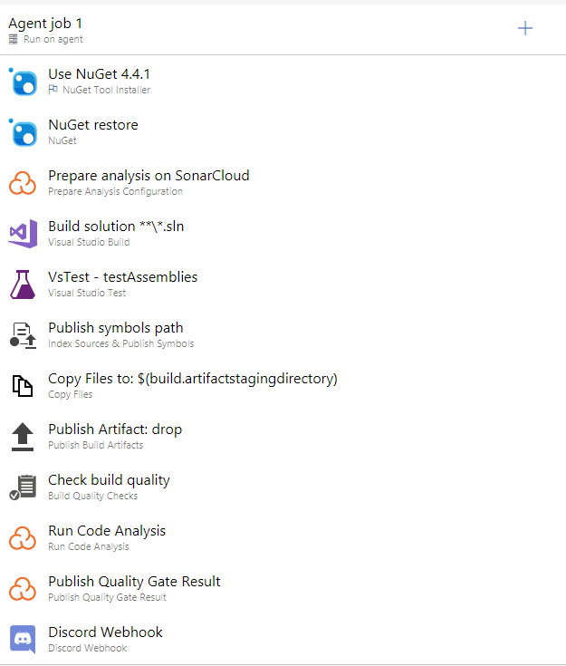
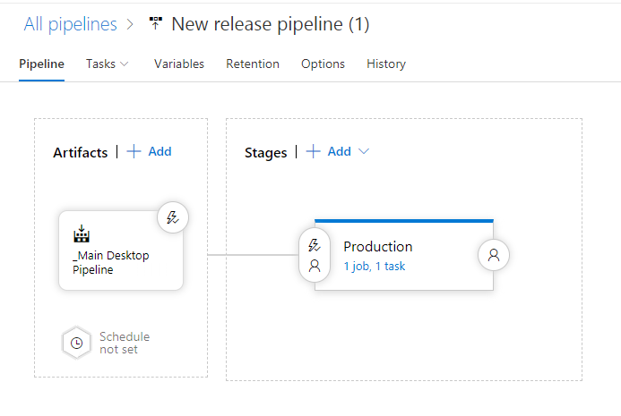
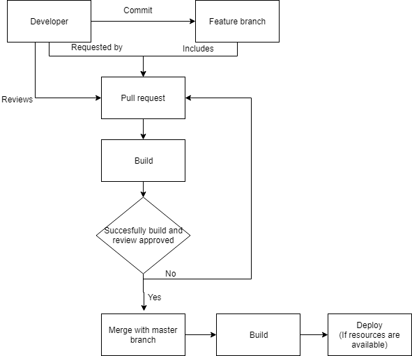

# Structuur

Hierbij een toelichting van elk plaatje structuur:

## Pipeline

### Toelichting
Hierbij een voorbeeld van de "Desktop Hotel" pipeline. Hierbij worden de packages voorbereid, de unit tests uitgevoerd, een poging tot builden binnen vs2017, doet sonarCloud een analyse op code quality, wordt er gekeken of code coverage minstens 80% gehaald wordt en ook hoger is dan de vorige succesvolle pull request en worden verder de meest essentiële build informatie verzonden naar een discord channel doormiddel van een webhook.

## Deployment

### Toelichting
Mocht de pull request succesvol zijn, dan zal deze deployed worden mochten we de resources ervoor hebben gehad 

## Pull request

### Toelichting
Hierbij het proces dat door de developer ingang wordt gezet wanneer deze een pull request doet.
